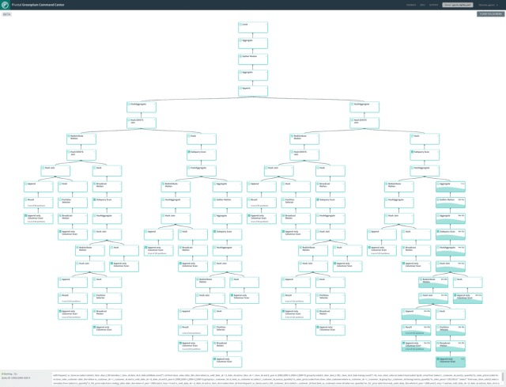
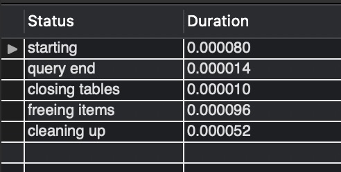

# 查询计划可视化

# 1. 项目代码仓库

[https://github.com/ReganWlg/visualPlan](https://github.com/ReganWlg/visualPlan)

# 2. 项目目的

1. 从 MySQL 中，获取查询计划数据，然后对数据进行可视化处理；
2. 提供对其他 dbms 的支持接口。

# 3. 参考对象

## 3.1 SqlServer


## 3.2 MySQL workbench


## 3.3 Greenplum DB



# 4. 查询计划数据获取

在初步对的调研中，有 3 种方法可以获取查询计划，我们最终选择使用 mysql analyze。

## 4.1 mysql explain

- 语法：explain \<DQL\>
- 例如：explain select * from VIEWS;
- 结果：

    

- 缺点：没有真正地执行，没有具体的执行时间；数据项不够。
- 优点：速度快，数据已经格式化了。

## 4.2 mysql analyze

- 语法：explain analyze \<DQL\>
- 例如：explain analyze explain analyze;
- 结果：（窗口问题，显示不全）

    

- 缺点：因为真正地执行 DQL，所以速度慢；数据没有格式化，需要我们手动格式化。
- 优点：数据项满足我们的要求。

## 4.3 mysql profile

- 语法：

    set profiling = 1;
    \<DQL\>
    show profile for query 1;

- 例如：

    set profiling = 1;
    select * from VIEWS;
    show profile for query 1;

- 结果：

    

- 缺点：因为真正地执行 DQL，所以速度慢；数据项不够。
- 优点：有具体的执行时间；数据已经格式化了。

# 5. 数据库通用接口

## 5.1 JDBC

java 的通用 dbms 接口协议。

## 5.2 ODBC

除了 java 的，C++ 的实现最好。

考虑到可能以后与 calcite 结合，所以使用 JDBC。

# 6. 可视化框架

会采用原生 java 的框架，javafx

1. 为了以后 calcite 的结合；
2. 与甲方的技术栈保持一致。

# 7. 目前的效果

## 7.1 version 1.0

```cpp
-> Nested loop left join  (cost=0.70 rows=1)
    -> Table scan on t1  (cost=0.35 rows=1)
    -> Filter: (t3.b is null)  (cost=0.70 rows=1)
        -> Nested loop left join  (cost=0.70 rows=1)
            -> Table scan on t2  (cost=0.35 rows=1)
            -> Filter: (t3.a = t2.a)  (cost=0.35 rows=1)
                -> Table scan on t3  (cost=0.35 rows=1)
```


## 7.2 version 2.0

### 7.2.1 连接数据库界面


- 数据库连接成功时，进入主界面
- 数据库连接失败时，弹出错误提示框

  

### 7.2.2 主界面

主界面初始状态没有查询执行计划，左侧显示当前数据库连接信息，以及待查询的SQL语句，右侧为空白。


- 断开数据库
  
  点击“断开数据库”按钮，将会断开当前数据库，返回至连接数据库界面
  

- 查询执行计划

  点击“查询执行计划”按钮，将对当前SQL语句进行查询，显示在右侧，可重复编辑SQL语句进行多次查询
  

# 8. 以后的任务

1. 未来在可视化中会强调某些操作的重要性。
    
    - 经过讨论，可能会根据操作的耗时来决定结点的显示大小或者颜色。
2. 如何测试？
    - 打算采用 MySQL 官方的测试的文档。这样能保证结果正确性与分支完整性。
    - 文档在`源码目录/mysql-test/r/*.result`
    - 

    